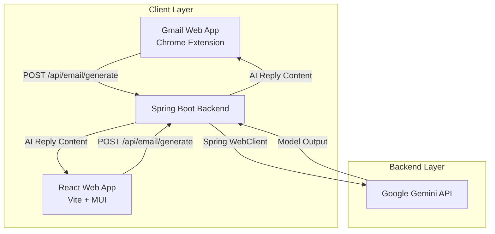

# 📧 Smart Email Replier & Assistant

<p align="center">
  
  
  
  
  
  
  
</p>

An intelligent, context-aware AI email reply assistant powered by **Google Gemini AI**. Featuring a robust **Spring Boot** backend, an intuitive **React + Material UI** web dashboard, and a seamless **Manifest V3 Chrome Extension** directly embedded inside Gmail.

---

## 🌟 Features

- 🧠 **Context-Aware Email Replies**: Analyzes the original email's core message, intent, and tone to generate natural, human-sounding replies without hallucinated details or awkward placeholders.
- 🎭 **Customizable Tone Profiles**: Effortlessly switch tones depending on the recipient:
  - `Professional`
  - `Friendly`
  - `Casual`
  - `Formal`
  - `Concise` / `Auto (Sender's Tone)`
- 📬 **Native Gmail Chrome Extension**:
  - Automatically detects Gmail reply & compose windows using real-time DOM mutation observers.
  - Injects a native **"AI Reply"** button and tone selector directly into your Gmail toolbar.
  - Generates and pastes the drafted email right into the Gmail editor with a single click.
- 💻 **Standalone Web Dashboard**:
  - Clean, responsive React interface built with Material UI.
  - Paste any email, select tone, preview generated drafts, and copy to clipboard.
- ⚡ **Asynchronous & Reactive API**:
  - Built with Spring Boot and Spring WebFlux `WebClient` for fast, non-blocking communication with Google Gemini endpoints.

---

## 🏗️ Architecture



---

## 📁 Repository Structure

```text
smart_email_replier/
│
├── email-writer/             # Spring Boot Backend (Java 21+, WebClient, Gemini AI)
│   ├── src/main/java/        # Controllers, Services, and DTOs
│   ├── src/main/resources/   # application.properties
│   ├── mvnw / mvnw.cmd       # Maven Wrapper
│   └── pom.xml               # Backend dependencies
│
├── email_frontend/           # React Web Application (Vite, React 19, MUI)
│   ├── src/                  # React components and styling
│   ├── package.json          # Frontend dependencies
│   └── vite.config.js        # Vite configuration
│
├── Email-writer-ext/         # Chrome Extension (Manifest V3)
│   ├── manifest.json         # Extension configuration & permissions
│   ├── content.js            # Gmail DOM injector & API caller
│   ├── content.css           # Toolbar button styling
│   └── icons/                # Extension icons
│
└── README.md                 # Project documentation
```

---

## 🚀 Getting Started

### 📋 Prerequisites

Ensure you have the following installed on your machine:
- **Java JDK 21** or later
- **Node.js** (v18.x or later) and **npm**
- **Google Chrome** (or any Chromium-based browser)
- A **Google Gemini API Key** ([Get your API key here](https://aistudio.google.com/))

---

### 1. ⚙️ Backend Setup (`email-writer`)

1. Open a terminal and navigate to the backend directory:
   ```bash
   cd email-writer
   ```

2. Set your environment variables for Gemini:
   - **Windows (PowerShell)**:
     ```powershell
     $env:GEMINI_API_URL="https://generativelanguage.googleapis.com"
     $env:GEMINI_API_KEY="YOUR_GEMINI_API_KEY"
     ```
   - **Windows (CMD)**:
     ```cmd
     set GEMINI_API_URL=https://generativelanguage.googleapis.com
     set GEMINI_API_KEY=YOUR_GEMINI_API_KEY
     ```
   - **Linux / macOS**:
     ```bash
     export GEMINI_API_URL="https://generativelanguage.googleapis.com"
     export GEMINI_API_KEY="YOUR_GEMINI_API_KEY"
     ```

3. Build and run the Spring Boot application:
   ```bash
   ./mvnw spring-boot:run
   ```
   *(On Windows without bash, run `mvnw.cmd spring-boot:run`)*

   The backend will start at `http://localhost:8080`.

---

### 2. 💻 Frontend Setup (`email_frontend`)

1. In a new terminal, navigate to the frontend directory:
   ```bash
   cd email_frontend
   ```

2. Install dependencies:
   ```bash
   npm install
   ```

3. Start the development server:
   ```bash
   npm run dev
   ```

4. Open your browser and visit:
   ```
   http://localhost:5173
   ```

---

### 3. 🧩 Chrome Extension Installation (`Email-writer-ext`)

1. Open Google Chrome and navigate to:
   ```
   chrome://extensions
   ```
2. Enable **Developer mode** using the toggle switch in the top-right corner.
3. Click the **Load unpacked** button in the top-left corner.
4. Select the `Email-writer-ext` folder from this repository.
5. Open [Gmail](https://mail.google.com):
   - Open any email thread and click **Reply** (or click **Compose**).
   - You will see the new **AI Reply** button and **Tone selector** right in the Gmail compose toolbar!

---

## 🔌 API Reference

### Generate Email Reply

- **Endpoint**: `POST /api/email/generate`
- **Content-Type**: `application/json`

#### Request Body:
```json
{
  "emailContent": "Hi Aryan, could you please share the progress update for the quarterly review meeting tomorrow?",
  "tone": "Professional"
}
```

#### Response:
```text
Hi,

Thank you for reaching out. The quarterly progress update has been finalized and will be ready for review ahead of tomorrow's meeting. Please let me know if there are specific points you would like highlighted.

Best regards,
Aryan Mishra
```

---

## 🛠️ Tech Stack

| Component | Technology | Description |
|---|---|---|
| **Backend** | Spring Boot 4 / Java 21+ | REST API & asynchronous HTTP client |
| **Networking** | Spring WebClient | Reactive HTTP integration with Gemini |
| **AI Model** | Google Gemini | Generative AI prompt handling |
| **Frontend** | React 19 + Vite | Fast, responsive Single Page Application |
| **UI Library** | Material UI (MUI v9) | Pre-built accessible components & styling |
| **Extension** | Chrome Manifest V3 | Content script with Gmail DOM injection |

---

## 🔒 Security Best Practices

- **API Keys**: Never commit your real Gemini API key to version control. Keys are injected via environment variables (`GEMINI_API_KEY`).
- **CORS**: Configured on `/api/email/generate` to securely permit requests from your local frontend and Chrome extension.

---

## 🤝 Contributing

Contributions are welcome! Please feel free to submit a Pull Request.

1. Fork the Project
2. Create your Feature Branch (`git checkout -b feature/AmazingFeature`)
3. Commit your Changes (`git commit -m 'Add some AmazingFeature'`)
4. Push to the Branch (`git push origin feature/AmazingFeature`)
5. Open a Pull Request

---

## 📄 License

This project is licensed under the [MIT License](LICENSE).
